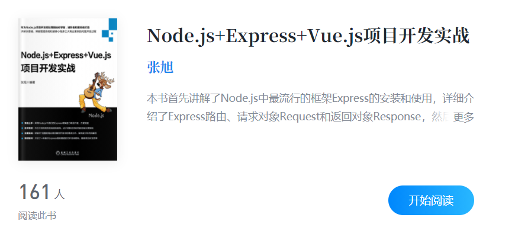

## awesome-node

这个仓库主要是用来学习node、node的框架express、koa、egg、deno和关于服务器相关的知识

学习一门技术最好的入门就是看官网的文档，然后自己动手实践加深对技术的理解，最后可以通过一些大佬编写的经典书籍来巩固和扩展知识。下面记录本人学习node过程所看的资料

----

### node

- [node.js英文官网](https://nodejs.org/dist/latest-v14.x/docs/api/)

- [node.js中文官网](http://nodejs.cn/api/)

### express(入门)

- [express英文官网](http://expressjs.com/)

- [express中文官网](https://www.expressjs.com.cn/)

- 
